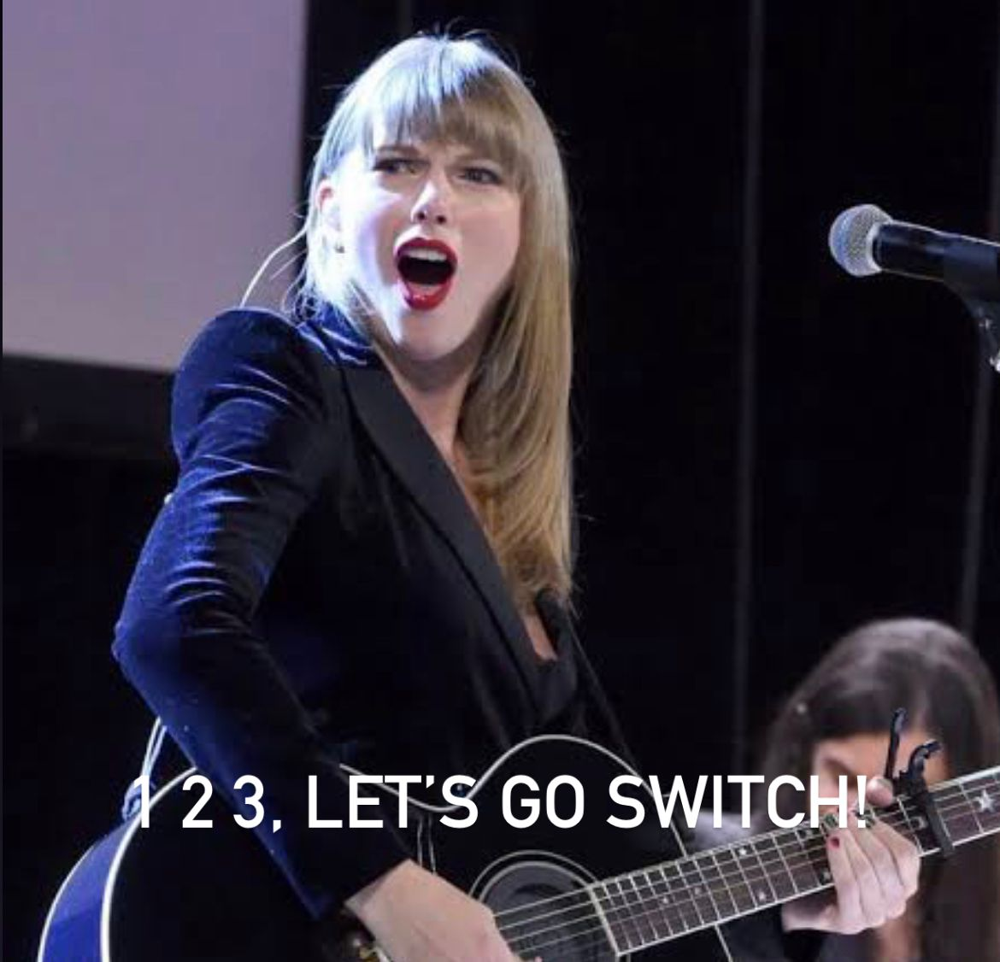

### [← Soal Final Praktikum](../../README.md)
<hr />

<div align=center>
  
# 1 2 3, LET’S GO SWITCH!

By: Shafa Kirana Mulia

 <br>

</div>

#### Description: 
Rara is really waiting for the Reputation TV to be released. Her favorite song from the Reputation album is Delicate with its iconic chant of "_1 2 3, LET’S GO-_". Oops, the real word is quite inappropriate, so she changed it to "_SWITCH_" instead. Since Rara loves data structure, she wants to program a code that can **swap nodes in a linked list**.

#### Input Format:
You are given a list with `value` (integer) until `-1` and an integer `k`. You need to swap the values of the `k`-th node from the beginning and the `k`-th node from the end of the list. The list is **1-indexed**.

#### Output Format:
Print the modified list after swapping the nodes.

#### Constraints:
- The number of nodes in the list is `n`
- 1 ≤ k ≤ n ≤ 1000
- 1 ≤ value ≤ 100

#### Sample Input 1:
```
1 2 3 4 5
-1
2
```

#### Sample Output 1:
```
1 4 3 2 5
```

#### Explanation 1:
Since the 2nd value from the beginning is 2 and the 2nd value from the end is 4, we swap those nodes.

#### Sample Input 2:
```
12 10 13 17 18 20 23 27 30 24
-1
7
```

#### Sample Output 2:
```
12 10 13 23 18 20 17 27 30 24
```

#### Explanation 2:
Since the 7th value from the beginning is 23 and the 7th value from the end is 17, we swap those nodes.
