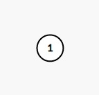
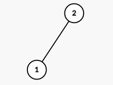
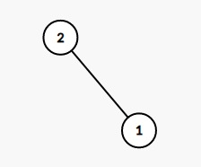

### [← Soal Final Praktikum](../../README.md)
<hr />

# Counting Tree
<p align="center">
  Time Limit : 1s<br>
  Memory Limit : 256 MB
</p>

#### Deskripsi: 
Diberikan 𝑁 buah node dinomori dari 1 sampai 𝑁 yang akan disusun untuk membentuk sebuah [binary tree](https://en.wikipedia.org/wiki/Binary_tree). Hitunglah berapa banyak konfigurasi binary tree berbeda yang dapat dibentuk apabila node parent selalu lebih besar dari pada node child nya. Dua konfigurasi binary tree dikatakan berbeda jika binary tree tersebut memiliki [representasi child](https://en.wikipedia.org/wiki/Binary_tree#Methods_for_storing_binary_trees) yang berbeda.

#### Format Masukan:
Sebuah baris berisi sebuah bilangan bulat 𝑁 yang menyatakan banyaknya node yang akan disusun.

#### Format Keluaran:
Sebuah baris berisi bilangan bulat yang menyatakan banyaknya konfigurasi binary tree berbeda. Keluarkan jawaban dalam modulo 10<sup>9</sup> + 7.

#### Batasan:
- 1 ≤ 𝑁 ≤ 10<sup>6</sup>

#### Contoh Masukan 1:
```
1
```

#### Contoh Keluaran 1:
```
1
```

#### Penjelasan Contoh 1:
Konfigurasi yang mungkin pada kasus ini adalah
<p align="center">
  <br>
  Figure 1: Satu-satunya konfigurasi untuk 𝑁 = 1
</p>

#### Contoh Masukan 2:
```
2
```

#### Contoh Keluaran 2:
```
2
```

#### Penjelasan Contoh 2:
Konfigurasi yang mungkin pada kasus ini adalah
<p align="center">
  <br>
  Figure 2: Konfigurasi untuk 𝑁 = 2<br><br>
  <br>
  Figure 3: Konfigurasi lain untuk 𝑁 = 2<br>
</p>
