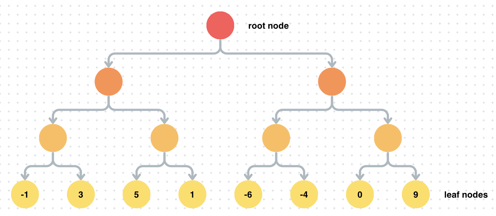
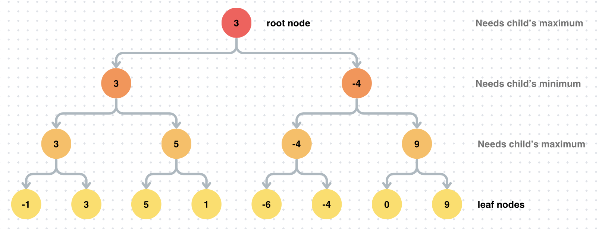

### [← Soal Final Praktikum](../../README.md)
<hr />

<div align=center>
  
# 森本

###### By: Ralfazza Rajariandhana
<a href="https://minesweeper.ralfazza.com/">
 <br>
</a>

</div>

#### Description: 
Usually in tree problems you are given the numbers to be inserted into the tree and you have to insert it starting from the root. Well for this problem you are given the value of the leaf nodes first and then you have to construct the tree from the leaf until the root. Now you might ask what would the values in the nodes be (other than the leaf nodes since it is given in the input)? The value of a node would either be the maximum or minimum value of its 2 children. The rules for it is as follows:
- The tree is a complete binary tree
- The value of the tree’s root will be the MAXIMUM of its left and right child’s values
- The value of leaf nodes are the numbers given in the input
- If the current level asks for MAXIMUM, then the next level would ask for the MINIMUM of its left and right child
- If the current level asks for MINIMUM, then the next level would ask for the MAXIMUM of its left and right child

Confused? Just see the example below!

#### Input Format:
First line is 𝑛 representing the number of leaf nodes. The next 𝑛 lines consists of 𝑥 where 𝑥 𝑥<sub>𝑖</sub> is the 𝑖-th leaf. 𝑥<sub>1</sub> is the leftmost leaf node while 𝑥<sub>𝑛</sub> is the rightmost leaf node. All given leaf nodes are located at the lowest depth of the tree.

#### Output Format:
The value of the root node.

#### Constraints and Rules
- 𝑛 = 2<sup>𝑘</sup>, 2 ≤ 𝑘 ≤ 20
- 𝑥<sub>𝑖</sub> ∈ [− 106, 106], 1 ≤ 𝑖 ≤ 𝑛
- It is guaranteed that the value of the leaves are unique

#### Sample Input 1:
```
8
-1
3
5
1
-6
-4
0
9
```

#### Sample Output 1:
```
3
```

#### Explanation 1:
You are given 8 leaf nodes and not knowing the rest of the node’s values.
<p align="center">
    
</p>

By following the rules in the description, the constructed tree would be as follows thus
you can output the value of the root node which is 3.
<p align="center">
    
</p>

#### Hint
● Hard work✊, pray🙏, and don’t forget to take a rest💤.
