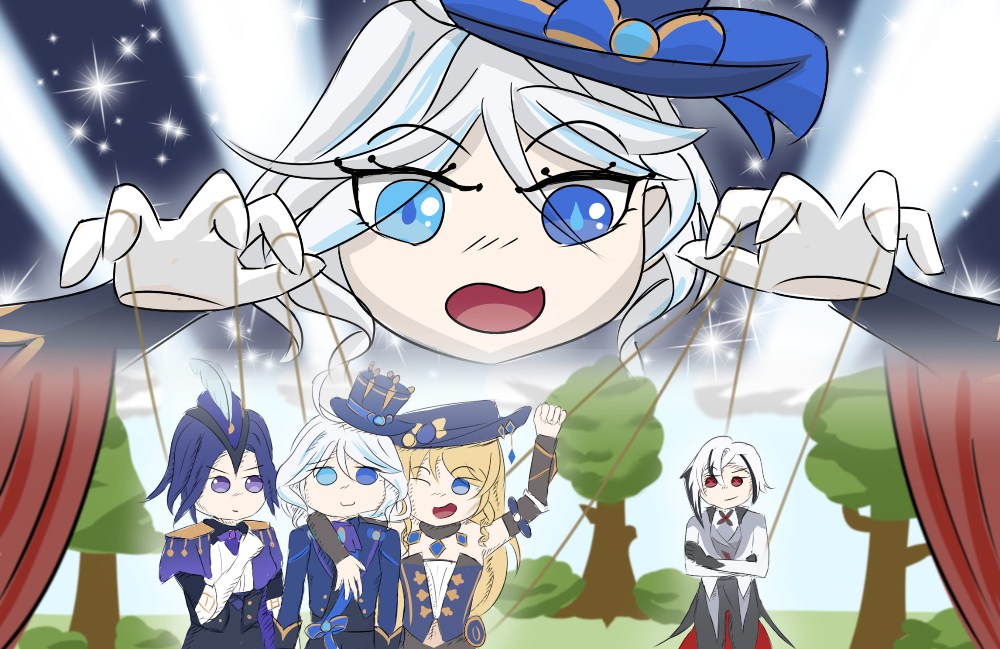

### [← Soal Final Praktikum](../../README.md)
<hr />

<div align=center>
  
# Let My Name Echo In Song!

 <br>

</div>

###### Ilustrasi dan soal oleh: Rakha Fathin
#### Deskripsi: 
Akhirnya masa yang telah ditunggu-tunggu telah tiba. Setelah Furina dan teaternya membahas ide, mengumpulkan ide, latihan, promosi, dan semua kerja keras oleh Furina dan teman-temannya, datanglah performance di Opera Epiclese yang sangat megah. Performance ini berjudul "A Star Is Reborn". Performance ini menceritakan tentang seseorang seniman yang telah jatuh dan gagal dalam kehidupannya. Namun, dia harus bangkit dan menghadapi kesulitan yang ada di dunia ini. Dia akan berusaha menghadapi lagi suatu hal yang membuat dia gagal. "*Something worse than failing, is giving up*".

Furina mengundang 3 bintang tamu yang akan tampil dalam performancenya, yaitu Navia, Clorinde, dan Arlecchino. Furina awalnya takut untuk mengundang Arlecchino karena alasan yang jelas. Namun, performance ini merupakan refleksi dirinya dan dia harus membangun keberanian untuk melakukan itu. Arlecchino pun juga bersedia karena dia merasa ini adalah salah satu cara untuk menebus kesalahan yang dia telah lakukan kepada Furina.

Furina memainkan pemeran utama, yaitu seseorang yang harus bangkit dan mengumpulkan keberanian dia untuk melawan sosok yang merepresentasikan trauma, kegagalan, dan putus asa. Sosok tersebut dimainkan oleh Arlecchino. Sedangkan Navia dan Clorinde memainkan teman pemeran utama yang akan selalu mendukungnya dalam perjuangannya.

Dalam suatu scene, Furina harus menemukan jalannya menuju Arlecchino. Furina juga dapat dibantu oleh Navia dan Clorinde. Panggung direpresentasikan oleh grid berbentuk M x N, setiap tile dapat berisi karakter-karakter berikut:

- ‘.’ yang merepresentasikan tile yang dapat dilewati,
- ‘#’ yang merepresentasikan tembok yang tidak dapat dilewati,
- ‘F’ yaitu dimana Furina berada,
- ‘A’ yaitu dimana Arlecchino berada,
- ‘N’ yaitu dimana Navia berada, dan
- ‘C’ yaitu dimana Clorinde berada

Berikut ketentuan yang **harus** diperhatikan:
- Furina harus mulai dari posisinya dengan tujuan akhir posisi Arlecchino.
- Setiap tile yang Furina harus lewati akan membutuhkan **2 langkah**.
- **Setiap tile dapat dilewati berkali-kali**.
- Jika Furina melewati **Navia**, Navia akan meluncurkan serangan artileri kepada grid yang menyebabkan **semua tembok dihancurkan**. Hal ini bisa membuat menemukan jalan menjadi lebih mudah.
- Jika Furina melewati **Clorinde**, Clorinde akan memberikan speed boost kepada Furina dan setelah itu langkah-langkah yang dibutuhkan Furina untuk melewati satu tile **hanya akan membutuhkan 1 langkah saja**. Hal ini dapat meningkatkan efisiensi dalam menemukan jalan.
- Furina **tidak harus** melewati Navia dan Clorinde.

Bantu Furina menemukan Arlecchino dengan langkah yang minimal. Furina mungkin ingin mengunjungi Navia dan/atau Clorinde untuk membantunya.

Catatan:
1. Dapat dipastikan hanya ada 1 Furina, 1 Arlecchino, 1 Navia, dan 1 Clorinde dalam
grid
2. Dapat dipastikan terdapat rute yang menghubungkan semua orang (tidak buntu).

#### Format Masukan:
Sebuah bilangan M dan N yang merupakan grid berukuran M x N. Diikuti dengan matriks berukuran M x N. dengan setiap anggota berisi karakter yang telah didefinisikan di atas.

#### Format Keluaran:
Jika Furina melewati Navia, keluarkan “Navia: Fire!!! ...Well, with rocks.”

Jika Furina melewati Clorinde, keluarkan “Clorinde: Hunt them down!”

Keluarkan “Furina: With **x** steps, let my name echo in song!”

Dengan x merupakan jumlah langkah minimum agar Furina dapat mencapai Arlecchino.

#### Batasan:
1 ≤ M, N ≤ 500

#### Sampel Input 0:
```
10 10
. . . C . . . . # .
. . . . . . . . . .
F . . . . . . . # .
. . . . . . # . . .
. . . . . . . . . .
. . . . . . # # # .
. . . . . # # A # .
. . . N . # . . . .
. . . # . # . . . .
. # # . . # . # # .
```

#### Sampel Output 0:
```
Clorinde: Hunt them down!
Navia: Fire!!! ...Well, with rocks.
Furina: With 22 steps, let my name echo in song!
```

#### Penjelasan Sampel 0:
Untuk membuat jalan Furina menjadi lebih efisien, Furina mengunjungi Clorinde terlebih dahulu dengan (5 langkah) x 2. Karena Furina mengunjungi Clorinde, keluarkan “Clorinde: Hunt them down!”.

Setelah itu, langkah yang diambil Furina setiap tile menjadi 1. Lalu Furina memilih untuk mengunjungi Navia dengan (7 langkah) x 1 untuk menghancurkan semua tembok. Karena Furina mengunjungi Navia, keluarkan “Navia: Fire!!! ...Well, with rocks.”.

<p align="center">
    
</p>

Berikut adalah kondisi grid setelah Furina mengunjungi Navia dan setelah Furina mengunjungi Arlecchino dengan (5 langkah) x 1.

<p align="center">
    
</p>

Total langkah yang diperlukan Furina adalah (5 x 2) + (12 x 1) = 22

#### Sampel Input 1:
```
6 6
. . C . . .
. . . . . .
F # A . . .
. # . . . .
N . . . . .
. . . . . .
```

#### Sampel Output 1:
```
Furina: With 8 steps, let my name echo in song!
```

#### Penjelasan Sampel 1:
Rute paling efisien adalah langsung mengunjungi Arlecchino dengan (4 langkah) x 2.
<p align="center">
    
</p>

Keterangan:

⬜: Tile yang dapat dilewati

🟥: Tile yang tidak dapat dilewati (Tembok)

🟩: Tile yang telah dilewati dengan bobot 2 langkah

🟨: Tile yang telah dilewati dengan bobot 1 langkah karena Clorinde

<p align="center">
    
</p>

#### Hint:
1. Algoritma bisa dijkstra/bfs tanpa time limit. Tapi jika memang time limit, bisa menggunakan yang lain, nama algonya ada di judul performance.
2. Metode paling gampang memang bruteforce :D

NOTES
- Print sesuai urutan, jika Furina ketemu Navia duluan output Navia dulu, dan
sebaliknya.
- Speedboost oleh Clorinde dan penghancuran tembok oleh Navia bersifat
PERMANEN setelah Furina mengunjungi mereka.
- Berusahalah lebih teliti pada kondisinya

Setelah Furina dan teman-temannya menyelesaikan performance yang telah disiapkan hingga saat ini, Mereka telah berhasil dan menjadi sebuah bintang, "A Star", seperti kalian yang setelah ini akan menaklukkan FP strukdat ini 😊.

<p align="center">
    SELAMAT MENGERJAKAN!
</p>
