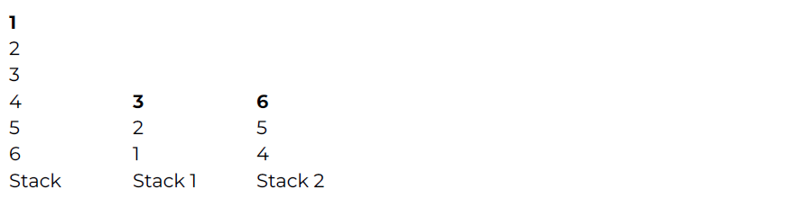

# Stack EZ Bro!
<p align="center">
  
</p>

#### Deskripsi: 
Pada suatu hari di kampus, salah satu sepuh TC bernama Alex menemukan sebuah tumpukan buku di perpustakaan yang terlihat sangat menarik baginya. Tumpukan buku yang ia temukan tersebut diurutkan secara acak sesuka hatinya. Ketika Alex sibuk menumpuk, tiba-tiba seorang ahli matematika, Sepuh X muncul dan memberikan tantangan kepada Alex. Sepuh X tersebut memberi instruksi kepada Alex untuk membagi tumpukan buku tersebut menjadi dua stack baru dengan cara yang unik.

Dengan semangat, Alex pun mulai menyelesaikan tantangan ini dengan penuh antusias karena ingin mendapatkan hadiah dari Sepuh X. Dengan setiap langkah yang diambil, stack-stack baru pun terbentuk dengan pola yang menarik. Akhirnya, hasil akhir dari tantangan ini pun tercapai, dan Alex merasa bangga dengan pencapaiannya dalam menyelesaikan permasalahan ini yang tergambar pada visualisasi dibawah ini.




Yang dibold merupakan Top of the Stack.

#### Format Masukan:
Baris pertama berisi 𝑛, banyaknya isi dari stack, dapat dipastikan genap. Baris kedua berisi 𝑛 bilangan isi stack.

#### Format Keluaran:
Isi stack 1<br>
Isi stack 2

#### Constraint:
2 ≤ 𝑛 ≤ 100 (banyaknya isi dari stack yang selalu berjumlah genap)<br>
1 ≤ 𝑚<sub>𝑖</sub> ≤ 10<sup>5</sup> (isi dari stack)

#### Contoh Input 1:
```
6
1 2 3 4 5 6
```

#### Contoh Output 1:
```
3 2 1
6 5 4
```

#### Contoh Input 2:
```
10
8 2 3 9 3 7 2 5 4 6
```

#### Contoh Output 2:
```
3 9 3 2 8
6 4 5 2 7
```

<p align="center">
  <b>SOAL HARUS DIKERJAKAN DENGAN MENGGUNAKAN STACK!</b>
</p>
