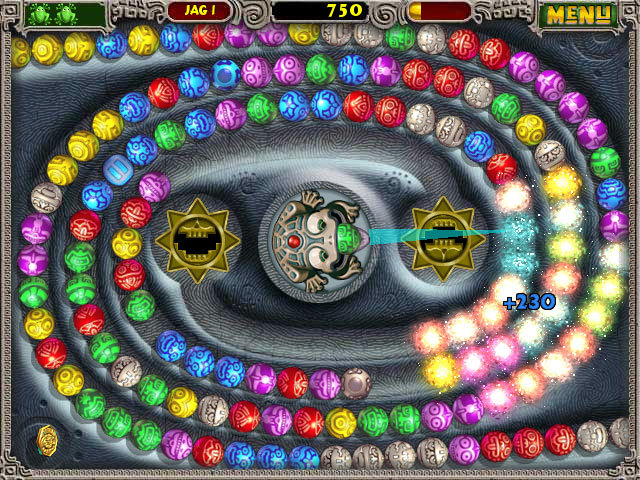

### [← Soal Praktikum 1](../../)
<hr />

### [E1 - Tobat1 (Easy-Medium)](../prob-E1)
### [E3 - Ulasan Buku (Easy-Medium)](../prob-E3)
### [E4 - Sosial Media (Medium-Hard)](../prob-E4)
# Juma
<p align="center">
  
</p>

#### Deskripsi: 
Juma adalah permainan teka-teki yang menguji kecepatan, ketepatan, dan strategi pemain. Pemain mengendalikan seekor kodok dan menembakkan bola berwarna untuk mencocokkan bola dengan 2 atau lebih warna yang sama, pemain dituntut untuk menghentikan bola-bola tersebut sebelum mencapai lubang kematian. Kodok juma akan menembak bola ke rangkaian bola, sebuah kelompok bola berdekatan dengan 2 atau lebih warna yang sama akan meledak apabila ditembakkan warna yang sama pula. Kemudian akan terjadi proses collision dimana bola akan terus bertabrakan dan akan hancur apabila bertemu dengan 2 atau lebih warna yang sama.

Diberikan kondisi dimana pemain menembakkan bola dan terjadi ledakan, maka tentukan berapa bola yang tersisa setelah proses collision.

#### Input:
Baris pertama berisi bilangan 𝑛 dan 𝑚 yang menyatakan banyaknya bola di sebelah kiri ledakan dan sebelah kanan ledakan.

Baris kedua berisi string dengan panjang 𝑛 dimana setiap karakter 𝑐 mewakilkan sebuah warna bola di sisi kiri ledakan.

Baris ketiga berisi string dengan panjang 𝑚 dimana setiap karakter 𝑐 mewakilkan sebuah warna bola di sisi kanan ledakan.

#### Output:
Sebuah angka yang menyatakan bola yang tersisa.

#### Constraints:
0 < 𝑛, 𝑚 ≤ 1000<br>
'A' ≤ 𝑐 ≤ 'Z'

#### Sample Input 1:
```
5 7
BPBRR
RBBPGGG
```

#### Sample Output 1:
```
4
```

#### Penjelasan Sample 1:
<p align="center">
  
</p>

Setelah terjadi ledakan pertama, bola-bola yang tersisa akan saling menempel. Ketika ada tiga bola warna merah yang bertabrakan, bola-bola merah tersebut akan meledak. Proses ini akan berulang terus-menerus sampai tidak ada lagi tabrakan antara dua atau lebih bola dengan warna yang sama.

#### Sample Input 2:
```
1 3
A
ABC
```

#### Sample Output 2:
```
2
```
