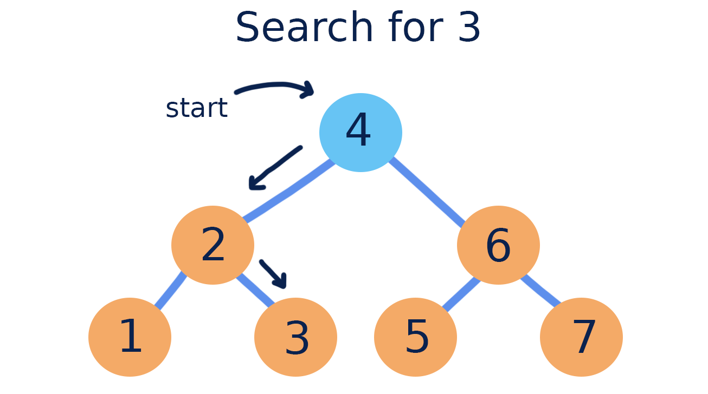
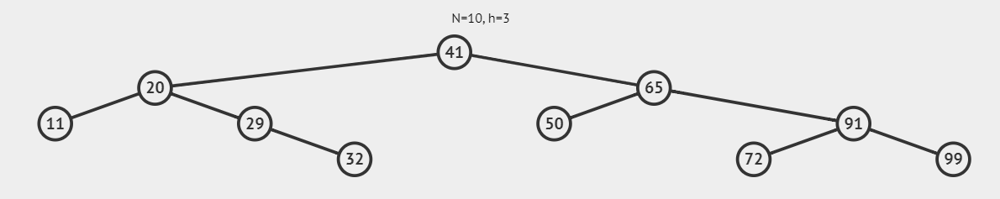

# Cari Node (CN)
<p align="center">
  
</p>

#### Deskripsi: 
Diberikan BST dengan **𝑁** anggota.<br>
Diberikan angka **𝑋** sebanyak **𝑇** kali, carilah apakah **𝑋** ada di BST tersebut.<br>
Apabila ada, maka keluarkan semua node / angka yang perlu dilewati untuk mencapai **𝑋**, urut dari atas (root).<br>
Apabila tidak ada, keluarkan -1.

#### Format Masukan:
Baris pertama berisi **𝑁**.<br>
Baris kedua berisi **𝑁** bilangan anggota BST (tidak ada anggota yang sama).<br>
Baris ketiga berisi **𝑇**.<br>
Setiap **𝑇** baris berikutnya berisi **𝑋**

#### Format Keluaran:
Apabila **𝑋** ada di BST, keluarkan semua node / angka yang perlu dilewati untuk mencapai **𝑋**, urut dari atas (root).<br>
Apabila **𝑋** tidak ada di BST, keluarkan -1.

#### Batasan:
1 ≤ 𝑁 ≤ 1000<br>
1 ≤ 𝑇 ≤ 1000<br>
1 ≤ 𝑋 ≤ 1000<br>
1 ≤ Anggota BST ≤ 1000

#### Contoh Masukan:
```
10
41
20 65 11 29 50 91 32 72 99
4
32
35
72
69
```

#### Contoh Keluaran:
```
41 20 29 32
-1
41 65 91 72
-1
```

#### Penjelasan Keluaran:
<p align="center">
  
</p>

1\. Karena 32 ada di BST, maka rute yang dilewati dari root ke 32 adalah 41 20 29 32.<br>
2\. Karena 35 tidak ada di BST, maka dikeluarkan -1.<br>
3\. Karena 72 ada di BST, maka rute yang dilewati dari root ke 72 adalah 41 65 91 72.<br>
4\. Karena 69 tidak ada di BST, maka dikeluarkan -1.
