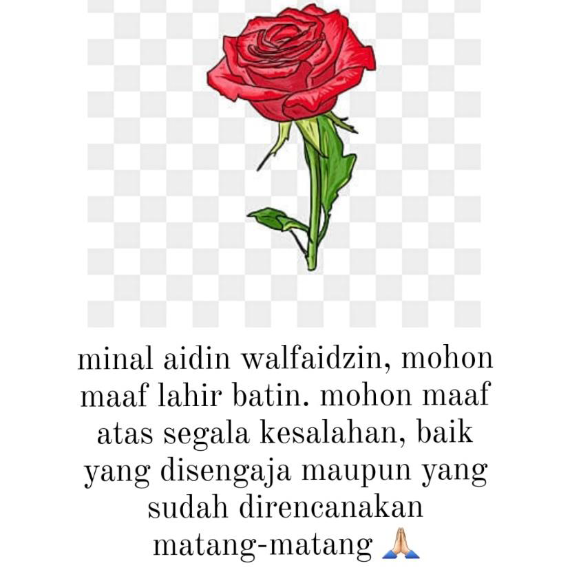

# Little Star
<p align="center">
  
</p>

#### Deskripsi: 
Haqqy sedang meneruskan perjalanan menggapai bintang, ditengah perjalanan Haqqy dihadang oleh seseorang dengan mengunakan baju logo “AVL”. Orang tersebut menanyai Haqqy dengan pertanyaan bertubi tubi.

Pertanyaannya cukup simpel Haqqy diberikan sembarang AVL dengan size 𝑁, Haqqy hanya perlu menjawab berapa maksimal perputaran dari AVL tersebut (Sembarang AVL size 𝑁). Petanyaan akan berhenti saat Haqqy sampai pada **𝑁 = -1144**.

**Note**: perputaran left dihitung satu, perputaran kanan dihitung satu, ya tiap perputaran dihitung satu.

**Untuk soal ini kalian diijinkan membuka**: **https://visualgo.net/en/**

**Saran**: Kerjain soal ini jika 3 lainnya dah kelar.

#### Format Masukan:
Bilangan 𝑁 di tiap barisnya.

#### Format Keluaran:
Print hasil sesuai perintah soal.

#### Batasan:
1 ≤ 𝑁 ≤ 10<sup>18</sup><br>
1 ≤ |*banyak baris*| ≤ 10<sup>6</sup>

#### Contoh Masukan 1:
```
1
2
3
-1144
```

#### Contoh Keluaran 1:
```
0
0
2
```

#### Penjelasan Contoh 1:
Untuk kasus 𝑁=3 kita dapat memisalkan AVL(1,2,3), AVL(2,1,3), dan AVL(1,3,2).

**AVL(2,1,3)**
<p align="center">
  
</p>
Tidak perlu rotasi agar menjadi AVL yang sempurna.<br><br>

**AVL(1,2,3)**
<p align="center">
  
</p>
Perlu 1 kali rotasi agar menjadi AVL yang sempurna.<br><br>

**AVL(1,3,2)**
<p align="center">
  
</p>
Perlu 2 kali rotasi agar menjadi AVL yang sempurna.<br><br>

Jadi akan di ambil AVL(1,3,2) dengan rotasi paling banyak yaitu **2 kali rotasi**.

#### Contoh Masukan 2:
```
2024
-1144
```

#### Contoh Keluaran 2:
```
4026
```

