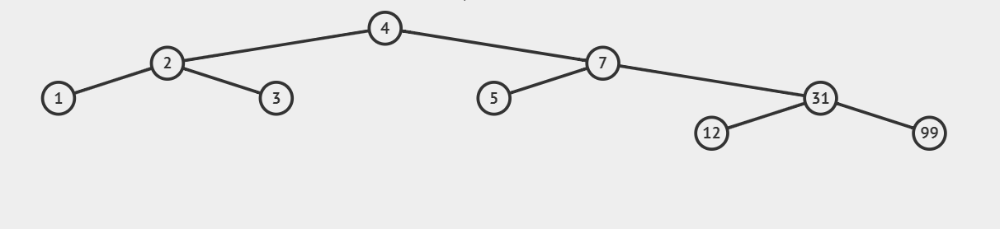
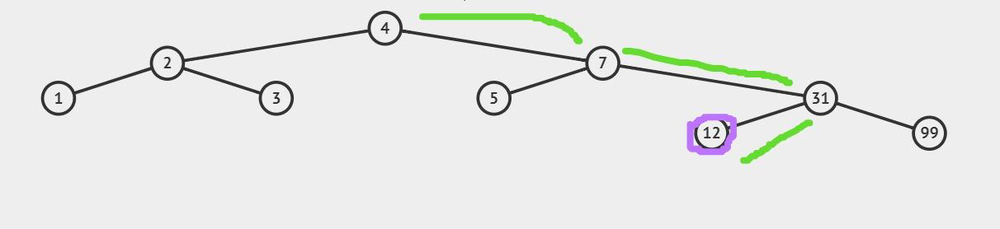

### [← Soal Praktikum 2](../../README.md)
<hr />

### [R1 - Cari Node (Easy-Medium)](../prob-R1/README.md)
### [R3 - Intermission (Easy-Medium)](../prob-R3/README.md)
# AVL_KANAN_KIRI

#### Deskripsi: 
Diberikan AVL dengan panjang 𝑁.

Diberikan suatu bilangan 𝑋, carilah bilangan 𝑋 apakah terdapat dalam AVL tersebut.

Jika suatu bilangan 𝑋 terdapat dalam AVL, maka carilah berapa banyak perpindahan kanan dan perpindahan kiri sampai menemukan bilangan yang sama.

**Untuk soal ini kalian diijinkan membuka**: **https://visualgo.net/en/**

HINT: Gunain fungsi find.

#### Format Masukan:
Bilangan 𝑁 dibaris pertama.<br>
Isi dari AVL dengan panjang 𝑁 dibaris kedua.<br>
Bilangan 𝑋 dibaris ketiga.

#### Format Keluaran:
Print hasil sesuai perintah soal.

#### Batasan:
1 ≤ 𝑁 ≤ 1000<br>
1 ≤ *element_AVL* ≤ 1000<br>
1 ≤ 𝑋 ≤ 1000

#### Contoh Masukan 1:
```
9
1 2 3 4 5 7 99 12 31
12
```

#### Contoh Keluaran 1:
```
ADA
Kiri : 1
Kanan : 2
```

#### Penjelasan Contoh 1:
<p align="center">
  
</p>

Dapat dilihat ada nilai 12 dalam AVL maka print(“ADA”).

Perjalanan dari root(4) menuju 12:<br>
Node 4 → kanan → node 7<br>
Node 7 → kanan → node 31<br>
Node 31 → kiri → node 12<br>
Kanan 2 kali<br>
Kiri 1 kali<br>
<p align="center">
  
</p>

#### Contoh Masukan 2:
```
9
1 2 3 4 5 7 99 12 31
13
```

#### Contoh Keluaran 2:
```
TIDAK ADA
```

