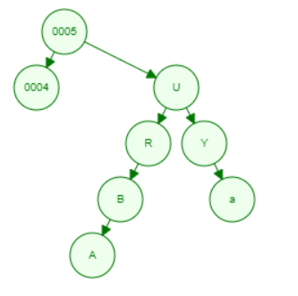

# Intermission
<p align="center">
  
</p>

#### Deskripsi: 
Furina melihat Irminsul membentuk BST dengan ukuran 𝑁, isi BST tersebut dapat berisikan berbagai macam karakter.

Bantu Furina melakukan preorder, inorder, dan postorder terhadap BST tersebut. Akan tetapi jangan tampilkan anggota yang merupakan angka.

#### Input Format:
Sebuah bilangan 𝑁 yang menyatakan banyaknya karakter dalam BST. 𝑁 karakter berikutnya adalah karakter 𝐶 yang merupakan karakter anggota dalam BST

#### Output Format: 
Baris pertama merupakan hasil preorder tanpa angka, baris kedua merupakan hasil inorder tanpa angka, baris ketiga merupakan hasil postorder tanpa angka.

#### Constraints:
1 ≤ 𝑁 ≤ 94<br>
𝐶 ∈ Semua karakter yang ada dalam variabel char.<br>
Dijamin semua 𝐶 unik.

#### Sample Input 0:
```
8
5 U R 4 B A Y a
```

#### Sample Output 0:
```
U R B A Y a
A B R U Y a
A B R a Y U
```

#### Visualisasi Sample 0:
<p align="center">
  
</p>

Note: Gambar diambil dari [link](https://www.cs.usfca.edu/~galles/visualization/BST.html) ini, kalian dapat membuka website tersebut untuk membantu kalian :D

#### Sample Input 1:
```
15
F u R 1 N A a < 3 O W 0 @ _ +
```

#### Sample Output 1:
```
F + A < @ u R N O a W _
+ < @ A F N O R W _ a u
+ @ < A O N _ W a R u F
```
