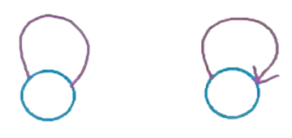

### [← Back](../README.md)
<hr />

### [Soal Latihan](Soal%20Latihan/README.md)
### [Soal Praktikum ](Soal%20Praktikum/README.md)
# Graf
- [**Pengenalan Graf**](#intro)
    - [Definisi Graf](#define)
    - [Properti Graf](#properties)
        - [1. Self-loop Edges dan Parallel Edges](#p1)
        - [2. Simple Graph](#p2)
        - [3. Walk, Path, dan Trail](#p3)
        - [4. Connected Graph](#p4)
        - [5. Cyclic Graph](#p5)
    - [Representasi Graf](#representation)
        - [1. Edge List](#r1)
        - [2. Adjacency Matrix](#r2)
        - [3. Adjacency List](#r3)
- [**Traversal Graf**](#traversal)
- [**Referensi**](#reference)

## Pengenalan Graf <a name="intro"></a>
### Definisi Graf <a name="define"></a>
Graf adalah sekumpulan _vertices_ (singular: _vertex_) atau _nodes_ yang dihubungkan oleh nol atau lebih _edges_. Berbeda dari _tree_ dimana terdapat aturan dalam hubungan antara _nodes_ (setiap _node_ hanya memiliki satu _parent_ dan sebagainya), graf tidak memiliki aturan apapun. Sebuah _tree_ juga merupakan sebuah graf, lebih tepatnya sebuah kelompok khusus dari graf.

Secara matematis, sebuah graf `𝐺` adalah pasangan terurut dari sekumpulan _vertices_ `𝑉` dan sekumpulan _edges_ `𝐸`, atau `𝐺 = (𝑉, 𝐸)`. Pasangan terurut ditandai dengan kurung biasa `()` dimana `(𝑎, 𝑏) != (𝑏, 𝑎)`, sedangkan pasangan tidak terurut ditandai dengan kurung kurawal `{}` dimana `{𝑎, 𝑏} == {𝑏, 𝑎}`. Terdapat dua jenis _edge_ dalam sebuah graf, yaitu **_directed_** dan **_undirected_** (perhatikan gambar di bawah). Sebuah graf yang **hanya** memiliki _directed edges_ disebut **_directed graph_** atau kadang-kadang disebut _digraph_, sedangkan graf yang **hanya** memiliki _undirected edges_ disebut **_undirected graph_**

<br>
<p align="center">
  <br>
  
</p>

Perhatikan contoh _undirected graph_ berikut. _Vertices_ pada graf tersebut dapat dinyatakan dengan `𝑉 = {𝑣1, 𝑣2, 𝑣3, 𝑣4, 𝑣5, 𝑣6, 𝑣7, 𝑣8}`, sedangkan _edges_ pada graf tersebut dinyatakan dengan pasangan tidak terurut dari _vertices_-nya, yaitu `𝐸 = {{𝑣1, 𝑣2}, {𝑣1, 𝑣3}, {𝑣1, 𝑣4},` `{𝑣2, 𝑣5}, {𝑣2, 𝑣6}, {𝑣3, 𝑣7}, {𝑣4, 𝑣8}, {𝑣7, 𝑣8}, {𝑣6, 𝑣8}, {𝑣5, 𝑣8}}`. Selain itu jumlah dari _vertex_ dan _edge_ dapat dituliskan masing-masing sebagai `|𝑉| = 8` dan `|𝐸| = 10` 

<br>
<p align="center">
  
</p>

Selain bersifat **_directed_** dan **_undirected_**, graf juga dapat bersifat **_weighted_** dan **_unweighted_**. Sebuah **_weighted graph_** adalah graf dimana setiap _edge_ memiliki bobot nilai atau _weight_. Sedangkan sebuah **_unweighted graph_** adalah graf dimana _weight_ dari setiap _edge_ bernilai sama atau umumnya bernilai 1. Salah satu contoh dari _weighted graph_ yang paling umum adalah graf yang menunjukkan hubungan antar kota, seperti contoh berikut.

<br>
<p align="center">
  
</p>

Pada graf tersebut, _weight_ setiap _edge_ menyatakan panjang jalan yang menghubungkan dua kota dalam km. Dengan adanya _weight_, rute terbaik belum tentu rute dengan _edges_ paling sedikit. Perhatikan gambar di bawah. Rute kuning umumnya merupakan rute terbaik karena hanya melalui 2 _edges_, sedangkan rute hijau dan merah sama baiknya karena masing-masing melalui 3 _edges_. Akan tetapi, dalam kasus ini, rute hijau adalah rute terbaik karena memiliki total _weight_ terkecil.

<br>
<p align="center">
  
</p>

### Properti Khusus Graf <a name="properties"></a>
#### 1. Self-loop Edges dan Parallel Edges <a name="p1"></a>
**Self-loop edges**: Sebuah _edge_ yang _origin vertex_ dan _destination vertex_ dari _edge_ tersebut sama.
<p align="center">
  
</p>

Contoh dari kasus yang memerlukan jenis _edge_ ini adalah representasi hubungan antara satu _webpage_ dengan _webpage_ lainnya sebagai graf. Pada kebanyakan _webpage_, terdapat link untuk melakukan navigasi dari satu bagian _web_ ke bagian _web_ lainnya. Jika link yang sama ditekan dua kali, maka tidak akan terjadi perubahan.

<p align="center">
  
</p>

**Parallel edges**: Sebuah _edge_ yang muncul lebih dari sekali dalam sebuah graf, disebut juga _multi-edge_.
<p align="center">
  
</p>

Contoh dari kasus yang memerlukan jenis _edge_ ini adalah representasi dari jalur penerbangan pesawat dengan graf. Pada umumnya, terdapat lebih dari satu pesawat yang melakukan penerbangan dari satu kota ke kota lainnya. Dengan kata lain, _edge_ yang sama dapat menyimpan harga penerbangan yang berbeda. Sehingga dapat dicari pesawat apa saja yang harus diambil untuk berpergian dengan harga termurah.
<p align="center">
  
</p>

#### 2. Simple Graph <a name="p2"></a>
**_Simple graph_** adalah graf yang tidak memiliki jenis _edge_ khusus diatas (_self-loop_ dan _parallel_). Dalam sebuah _simple directed graph_ kita dapat mencari jumlah maksimal _edge_ yang dapat dibentuk jika jumlah _vertices_-nya diketahui. Perhatikan contoh berikut untuk graph dengan `𝑛 = 4` _vertices_. Jumlah _edge_ minimal dicapai saat setiap _vertex_ tidak memiliki satupun _edge_, yaitu 0. Sedangkan jumlah _edge_ maksimal dicapai saat setiap _vertex_ terhubung dengan _vertex_ lainnya. Karena ada 4 _vertex_, maka setiap _vertex_ akan memiliki 3 atau (4 - 1) _edges_ untuk terhubung dengan setiap vertex lainnya. 
<p align="center">
  
</p>

Jika digeneralisasi, untuk **_simple directed graph_** dengan `𝑛` vertices (dimana `𝑛 ≥ 0`) maka jumlah _edge_ `|𝐸|` pada graf tersebut berada pada interval `0 ≤ |𝐸| ≤ 𝑛(𝑛-1)`. Untuk **_simple undirected graph_** dari graf yang sama, jumlah maksimal akan berkurang sebanyak setengahnya, karena setiap 2 pasangan dianggap menjadi 1, atau `0 ≤ |𝐸| ≤ 𝑛(𝑛-1)/2`.

Sebuah graf disebut **_dense_** jika jumlah _edge_-nya mendekati nilai maksimal, dan sebaliknya disebut **_sparse_** jika jumlah edgenya mendekati jumlah _vertex_. Jumlah _edge_ akan memengaruhi jenis struktur data yang digunakan untuk menyimpan graf.

#### 3. Walk, Path, dan Trail <a name="p3"></a>
**Walk**: Sebuah urutan _vertices_ dimana setiap _vertex_ yang berurut terhubung oleh sebuah _edge_. Pada _directed graph_, setiap _edge_ yang dilalui harus searah. `<𝐴, 𝐵, 𝐹, 𝐻, 𝐸, 𝐵, 𝐴, 𝐷>` adalah sebuah _walk_.
<p align="center">
  
</p>

**Path**: Sebuah _walk_ dimana tidak ada _vertex_ yang dikunjungi lebih dari sekali (akibatnya **tidak ada** _edge_ yang dikunjungi lebih dari sekali juga).<br>
`<𝐴, 𝐵, 𝐹, 𝐻>` adalah sebuah _path_.
<p align="center">
  
</p>

**Trail**: Sebuah _walk_ dimana tidak ada _edge_ yang dikunjungi lebih dari sekali (tetapi **bisa ada** _vertex_ yang dikunjungi lebih dari sekali).<br>
`<𝐴, 𝐵, 𝐸, 𝐻, 𝐷, 𝐴, 𝐶>` adalah sebuah _trail_.
<p align="center">
  
</p>

#### 4. Connected Graph <a name="p4"></a>
**Connected**: Sebuah urutan _vertices_ dimana setiap _vertex_ yang berurut terhubung oleh sebuah _edge_. Pada _directed graph_, setiap _edge_ yang dilalui harus searah.
<p align="center">
  
</p>

**Strongly Connected Graph**: Sebuah _walk_ dimana tidak ada _vertex_ yang dikunjungi lebih dari sekali (akibatnya **tidak ada** _edge_ yang dikunjungi lebih dari sekali juga).
<p align="center">
  
</p>

**Weakly Connected Graph**: Sebuah _walk_ dimana tidak ada _edge_ yang dikunjungi lebih dari sekali (tetapi **bisa ada** _vertex_ yang dikunjungi lebih dari sekali).
<p align="center">
  
</p>

#### 5. Cyclic Graph <a name="p5"></a>
**Walk**: Sebuah urutan _vertices_ dimana setiap _vertex_ yang berurut terhubung oleh sebuah _edge_. Pada _directed graph_, setiap _edge_ yang dilalui harus searah. `<𝐴, 𝐵, 𝐹, 𝐻, 𝐸, 𝐵, 𝐴, 𝐷>` adalah sebuah _walk_.
<p align="center">
  
</p>

**Path**: Sebuah _walk_ dimana tidak ada _vertex_ yang dikunjungi lebih dari sekali (akibatnya **tidak ada** _edge_ yang dikunjungi lebih dari sekali juga).<br>
`<𝐴, 𝐵, 𝐹, 𝐻>` adalah sebuah _path_.
<p align="center">
  
</p>

**Trail**: Sebuah _walk_ dimana tidak ada _edge_ yang dikunjungi lebih dari sekali (tetapi **bisa ada** _vertex_ yang dikunjungi lebih dari sekali).<br>
`<𝐴, 𝐵, 𝐸, 𝐻, 𝐷, 𝐴, 𝐶>` adalah sebuah _trail_.
<p align="center">
  
</p>

### Representasi Graf <a name="representation"></a>
Untuk menyimpan sebuah graf dalam memori komputer, terdapat 3 cara yang paling sering digunakan, yaitu _edge list_, _adjacency matrix_, dan _adjacency list_. Representasi graf yang berbeda dapat berpengaruh pada:
- Jumlah memori yang digunakan
- Kecepatan saat melakukan _search_ atau manipulasi data
- Kesesuaian dengan jenis graf

Terdapat 3 cara yang sering digunakan untuk merepresentasikan graf. Akan digunakan _undirected graph_ dibawah sebagai contoh graf.

<br>
<p align="center">
  
</p>

#### 1. Edge List <a name="r1"></a>
Edge List adalah representasi graf dilakukan dengan menyimpan semua daftar _edge_ yang ada dalam suatu graf. Penyimpanan dapat dilakukan di dalam sebuah array statis maupun dinamis seperti **vector**. Pengimplementasiannya dapat menggunakan struct yang berisi _vertex_ yang berada diujung _edge_ tersebut beserta _weight_-nya (jika ada).

```cpp
struct Edge
{
    string startVertex;
    string endVertex;
    int weight;
}

Edge edgeList[MAX_SIZE];
```

<br>
<p align="center">
  
</p>


#### 2. Adjacency Matrix <a name="r2"></a>
Adjacency Matrix adalah representasi graf yang menggunakan matrix berukuran `|V| x |V|`. Pada indeks dari matrix, digunakan nilai:
- **0** jika tidak terdapat _edge_ yang menghubungkan _vertex_ i dengan _vertex_ j.
- **1** jika terdapat _unweighted edge_ yang menghubungkan _vertex_ i dengan _vertex_ j.
- **_weight_** jika terdapat _weighted edge_ yang menghubungkan _vertex_ i dengan _vertex_ j.

```cpp
int adjacencyMatrix[V][V];
```

<br>
<p align="center">
  
</p>

#### 3. Adjacency List <a name="r3"></a>
Adjacency Matrix adalah representasi graf yang dilakukan dengan hanya menyimpan daftar dari _vertex_-_vertex_ lain yang memiliki _edge_ yang terhubung dengan suatu _vertex_. Penyimpanan dapat dilakukan di dalam sebuah array statis maupun dinamis seperti **vector**

```cpp
vector<pair<int, int>> adjacencyList;
```

<br>
<p align="center">
  
</p>

## Traversal Graf <a name="traversal"></a>

## Referensi <a name="reference"></a>
- [Algoritma dan Pemrograman ITS - Modul Struktur Data 2020](https://github.com/AlproITS/StrukturData/wiki)
- [Algoritma dan Pemrograman ITS - Modul Struktur Data 2023](https://github.com/Algoritma-dan-Pemrograman-ITS/StrukturData/wiki)
- [mycodeschool - Data structures](https://www.youtube.com/playlist?list=PL2_aWCzGMAwI3W_JlcBbtYTwiQSsOTa6P)
