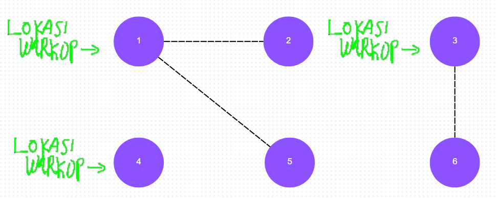

# Solusi
### Ide
Tinjau kasus berikut:
```
6 3 3 2
1 2
1 5
3 6
```

<p align="center">
  
</p>

*Garis putus-putus hanya untuk menandakan bahwa terdapat portal yang **dapat** diaktifkan, **bukan** berarti portal tersebut **sudah** diaktifkan.*

Agar warkop dapat selalu diakses, setiap kepulauan harus terdapat setidaknya 1 warkop. Dalam kondisi ini, _value_ dari sebuah portal dan sebuah warkop setara (dalam artian pembuatan satu portal sama manfaatnya dengan pembuatan satu warkop, dimana keduanya hanya menambah akses ke 1 pulau). Sehingga hanya ada 2 kemungkinan cara untuk meminimalkan waktu untuk setiap case:

- Ketika waktu pembuatan warkop lebih lama dari pembuatan portal, setiap pulau dibangun sebuah warkop, dan tidak ada pulau yang dihubungkan dengan portal. Sehingga waktu minimal yang dibutuhkan adalah

$$
M = W × V
$$

𝑀 : menyatakan waktu minimum yang dibutuhkan.<br>
𝑊 : menyatakan waktu untuk membuat sebuah warkop di sebuah pulau.<br>
𝑉 : menyatakan banyaknya pulau.

- Ketika waktu pembuatan portal lebih lama dari pembuatan warkop, setiap kepulauan akan memiliki satu warkop, warkop akan dibangun sebanyak jumlah kepulauan, dan sisa pulau sisanya akan dibangun portal untuk menghubungkan mereka ke warkop yang dapat dicapai. Sehingga waktu minimal yang dibutuhkan adalah

$$
M = W × K + P × (V - K)
$$

𝑀 : menyatakan waktu minimum yang dibutuhkan.<br>
𝑊 : menyatakan waktu untuk membuat sebuah warkop di sebuah pulau.<br>
𝑃 : menyatakan waktu untuk menghubungkan 2 pulau dengan mengaktifkan portal.<br>
𝑉 : menyatakan banyaknya pulau.<br>
𝐾 : menyatakan banyaknya kepulauan (kumpulan pulau yang bisa dihubungkan).

Sehingga masalah utama pada soal ini adalah mencari jumlah kepulauan yang ada. Waktu minimal dapat dicari dengan membanding waktu yang dibutuhkan untuk membuat portal dan warkop.

### Pendekatan
Hitung jumlah kepulauan dengan melakukan DFS terhadap seluruh node, pastikan jika sebuah node sudah pernah dikunjungi, node itu akan di-skip untuk iterasi selanjutnya.

### Implementasi
```cpp
// struct graph
// {
//    long vertexCount, edgeCount;
//    vector<vector<long>> adjList;
//    ⫶
//    

      vector<long> dfs()
      {
          vector<bool> visited(vertexCount, false);
          long islandSize = 0;
          for (int i = 0; i < vertexCount; i++)
          {
              if (!visited[i])
              {
                  stack<long> st;
                  st.push(i);
                  visited[i] = true;
      
                  while (!st.empty())
                  {
                      long temp = st.top();
                      st.pop();
                      provincesSize++;
      
                      for (auto vertex : adjList[temp])
                      {
                          if (!visited[vertex])
                          {
                              st.push(vertex);
                              visited[vertex] = true;
                          }
                      }
                  }
      
                  islandSize++;
              }
          }
      
          return islandSize;
      }

//
// ⫶
// }
```
