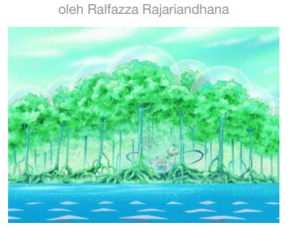

# CJ5 | Versus CP5
<p align="center">
  <a href="https://minesweeper.ralfazza.com/">
    
  </a>  
</p>

#### Deskripsi: 
Berkat bantuanmu, kapten CJ telah mendapatkan kekuatan Cloud Cloud Fruit, Devil Fruit yang sudah lama diincar agensi CP5. Di Kepulauan Sabaody, beberapa kapal CP5 tiba untuk menangkap mereka, para agen CP5 ditempatkan pada setiap jembatan penghubung antar pulau. Kalian telah berhasil mendapatkan informasi jumlah agen yang diposisikan pada setiap jembatan. Dengan kekuatan Cloud Cloud Fruit, CJ dapat terbang dan mengangkut krunya untuk menghindari perlawanan dengan para agen yang ada di suatu jembatan namun karena ia belum familiar dengan kekuatannya, ia hanya bisa melakukan hal ini sekali. Kamu sadar bahwa kepulauan dapat direpresentasikan sebagai vertices dan jembatan penghubung pulau sebagai edges dengan jumlah agen yang ada pada sebuah jembatan sebagai weight. Dengan ini kamu bisa menemukan jumlah agen CP5 paling sedikit yang harus para kru lawan. Sekali lagi kamu harus menggunakan kekuatan Code Code Fruit milikmu untuk menyelamatkan para kru.


#### Format Masukan:
Diberikan sebuah directed weighted graph di mana input baris pertama terdiri atas 𝑣 (jumlah pulau/vertices) dan 𝑒 (jumlah jembatan/edges). Pulau diberikan nomor dari 0 hingga 𝑣 − 1. Sebanyak 𝑒 baris berikutnya terdiri atas 𝑃 𝑄 𝑊, merepresentasikan jumlah agen/weight dari pulau 𝑃 ke 𝑄 adalah sebanyak 𝑊.


#### Format Keluaran:
Jumlah total agen CP5 paling sedikit yang harus dilawan mulai dari pulau 0 hingga pulau 𝑣 − 1 jika CJ dapat terbang dan mengangkat krunya hanya sekali (ini berarti bahwa agen yang dilawan pada sebuah jembatan yang mereka lalui dengan memilih untuk terbang adalah 0).


#### Batasan dan Aturan:
- 𝑣 ∈ [3,100]
- 𝑒 ∈ [𝑣 − 1,𝑣<sup>2</sup> - 𝑣]
- 𝑃 , 𝑄 ∈ [0, 𝑣 − 1]
- W ∈ [1,100]
- Dipastikan hanya ada 1 edge dari sebuah vertex menuju vertex adjacent-nya (misal ada vertex A dan B, maka dari A ke B hanya ada maksimum 1 edge, tidak mungkin ada 2 atau lebih edge dari A ke B)
- Dipastikan ada setidaknya 1 jalur dari vertex 0 ke 𝑣 − 1
- Kamu hanya punya 1 kesempatan untuk terbang dan menghindari pertarungan pada sebuah jembatan

#### Contoh Masukan 1:
```

```

#### Contoh Keluaran 1:
```

```

#### Penjelasan Keluaran 1:
Ada total 6 jalur yang mungkin, jalur di mana kau melawan dengan jumlah agen paling sedikit adalah dengan pergi dari pulau 0 ke pulau 2 (melawan 5 agen) dan lalu terbang dari pulau 2 ke pulau 3 (tidak melawan karena terbang).


#### Hint
Kalian dapat membuat sebuah fungsi yang mengubah weight sebuah edge menjadi 0 untuk sementara
