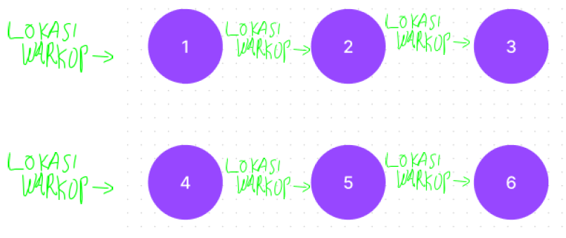

### [← Soal Praktikum 3](../../README.md)
<hr />

### [E1 - Thank You (Easy-Medium)](../prob-E1/README.md)
### [E2 - Telat Gak Ya? (Easy-Medium)](../prob-E2/README.md)
### [E3 - Maximum Spanning Tree (Easy-Medium)](../prob-E3/README.md)
# Isekai Warkop
<p align="center">
  
</p>

#### Deskripsi: 
Alan adalah seorang programmer sejati, tiap hari ia menghabiskan waktu 23 jam untuk ngoding, sisanya tidur sambil menunggu kompilasi programnya selesai. Untuk mengatasi rasa kantuknya ia biasa membeli kopi di warkop dekat rumahnya. Namun suatu saat karena kebiasaan buruknya ini Alan dipindah paksakan ke isekai. Sebelum dipindah paksakan ke sebuah isekai Alan bertemu dengan Eris, seorang dewi penjaga multiverse. Eris mengagumi kerja keras Alan, oleh karena itu Eris akan mengabulkan satu permintaan Alan.

Karena yang dipikiran Alan hanya ngoding, ia meminta agar di isekai, tempat ia dipindahkan nanti terdapat warkop yang bisa ia kunjungi. Karena Alan bisa menciptakan sebuah komputer, namun tidak bisa membuat kopi. Eris mengabulkan permintaan Alan. Namun tak beberapa lama kemudian Eris menyadari bahwa Ia sendiri tidak mengetahui di isekai mana tempat Alan direinkarnasikan. 

Mula-mula dunia tempat Alan direinkarnasikan berupa kepulauan yang dipisahkan oleh lautan. Eris mempunyai pilihan untuk mengaktifkan portal yang menghubungkan antara 2 pulau dan membangun warkop di sebuah pulau. Tidak semua pasang pulau memiliki portal yang menghubungkannya. Mengaktifkan portal dan membangun warkop memakan waktu, jadi Eris harus berpikir bagaimana dia
bisa menyediakan warkop untuk Alan dengan cepat.

#### Input:
Baris pertama berisi bilangan 𝑇 yang menyatakan banyaknya testcase, dimana setiap test case berupa barisan bilangan 𝑉 𝐸 𝑊 𝑃.

𝑉 : menyatakan banyaknya pulau.<br>
𝐸 : menyatakan banyaknya pulau yang bisa dihubungkan dengan portal.<br>
𝑊 : menyatakan waktu untuk membuat sebuah warkop di sebuah pulau.<br>
𝑃 : menyatakan waktu untuk menghubungkan 2 pulau dengan mengaktifkan portal.

𝐸 baris berikutnya berisi 𝐴<sub>𝑖</sub> 𝐵<sub>𝑖</sub> yang menyatakan pasangan pulau yang bisa dihubungkan dengan portal.

#### Output:
Setiap test case print M yang menyatakan minimum waktu yang diperlukan untuk menyediakan warkop yang bisa diakses Alan.

#### Constraints:
0 < 𝑇 ≤ 10<br>
0 < 𝑉 ≤ 10<sup>5</sup><br>
0 ≤ 𝐸, 𝑊, 𝑃 ≤ 10<sup>5</sup><br>
0 < 𝐴<sub>𝑖</sub>, 𝐵<sub>𝑖</sub> ≤ 𝑉

#### Sample Input:
```
2
3 3 2 1
1 2
3 1
2 3
6 6 2 5
1 3
3 4
2 4
1 2
2 3
5 6
```

#### Sample Output:
```
4
12
```

#### Explanation:
**Case 1**: Waktu yang minimum adalah 4 (membangun 1 warkop dan menghubungkan 2 pulau).

*_portal 2 dan 3 tidak perlu diaktifkan karena dimanapun alan berada ia bisa mengakses warkop
dengan jalan yang ada_.

Graph Case 1:
<p align="center">
  
</p>

**Case 2**: Waktu yang minimum adalah 12 (membangun 6 warkop)

*_dimanapun alan berada ia bisa mengakses warkop karena warkop tersedia di setiap pulau_.

Graph Case 2:
<p align="center">
  
</p>
