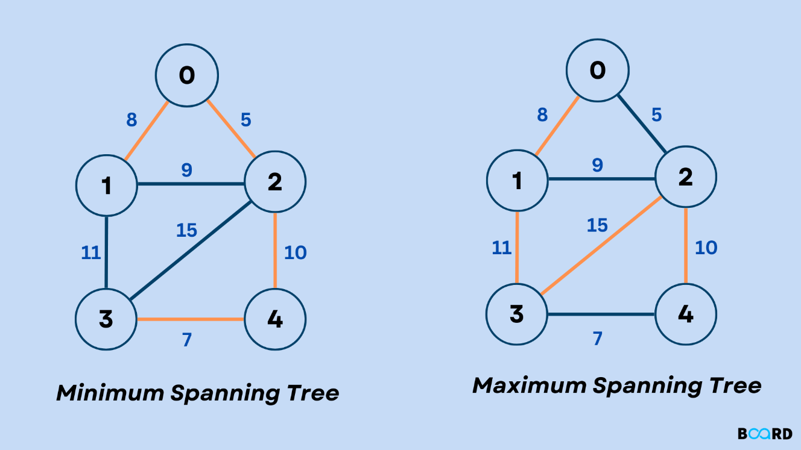
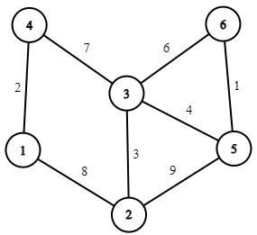
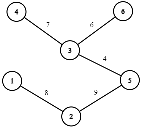

### [← Soal Praktikum 3](../../README.md)
<hr />

### [R1 - Tree or Bush (Easy-Medium)](../prob-R1/README.md)
### [R2 - CJ5 | Versus CP5 (Easy-Medium)](../prob-R2/README.md)
# Hapus Edge (HE)
<p align="center">
  
</p>

#### Deskripsi: 
Terdapat sebuah graf dengan 𝑁 node (bernomor 1 hingga 𝑁) dan 𝑀 edge. Setiap node pada graf tersebut saling terhubung. Akan dilakukan penghapusan beberapa edge untuk mengubah graf tersebut menjadi sebuah tree. Terdapat biaya yang dibutuhkan utnuk menghapus sebuah edge. Tentukan biaya penghapusan minimum supaya bisa terbentuk tree dari graf tersebut.

#### Format Masukan:
Baris pertama berisi 𝑁 dan 𝑀.

Pada setiap 𝑀 baris berikutnya berisi 𝑈, 𝑉, dan 𝑊 (edge yang menghubungkan node 𝑈 dan 𝑉, dengan biaya penghapusan sebesar 𝑊).

#### Format Keluaran:
Keluarkan biaya penghapusan minimum supaya bisa terbentuk tree dari graf tersebut.

#### Batasan:
1 ≤ 𝑁 ≤ 1000<br>
𝑁 − 1 ≤ 𝑀 ≤ 10<sup>5</sup><br>
1 ≤ 𝑈, 𝑉 ≤ 𝑁<br>
1 ≤ 𝑊 ≤ 10<sup>4</sup>

#### Contoh Masukan 1:
```
6 8
1 2 8
2 3 3
3 4 7
1 4 2
2 5 9
3 5 4
3 6 6
5 6 1
```

#### Contoh Keluaran:
```
6
```

#### Penjelasan:
<p align="center">
  
</p>

Dari graf di atas, untuk membentuk tree dengan biaya minimum, maka edge-edge yang perlu dihapus adalah (1, 4, 2), (2, 3, 3), dan (5, 6, 1). Sehingga terbentuk tree seperti berikut:
<p align="center">
  
</p>
