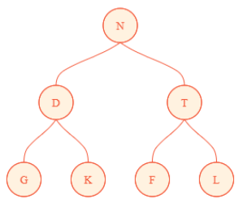
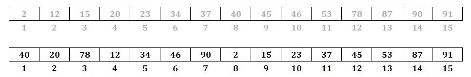

# Exercises 9
> Tugas ke-7 mata kuliah Struktur Data 2024<br>
> Referensi: _Noel Kalicharan - Advanced Topics in C_<br>
- [**Questions**](#qs)
    - [Q10. Draw Binary Search Tree](#q10)
    - [Q11. Sum of Levels](#q11)
    - [Q12. Draw Binary Tree From Traversal I](#q12)
    - [Q13. Draw Binary Tree From Traversal II](#q13)
    - [Q14. Binary Tree Traversal](#q14)
    - [Q15. Binary Search Tree Traversal](#q15)
    - [Q16. Complete Binary Search Tree](#q16)
- [**Solutions**](#ss)
    - [S10. Draw Binary Search Tree](#s10)
    - [S11. Sum of Levels](#s11)
    - [S12. Draw Binary Tree From Traversal I](#s12)
    - [S13. Draw Binary Tree From Traversal II](#s13)
    - [S14. Binary Tree Traversal](#s14)
    - [S15. Binary Search Tree Traversal](#s15)
    - [S16. Complete Binary Search Tree](#s16)
- [**Tools**](#tools)

## Questions <a name="qs"></a>
### Q10. Draw Binary Search Tree <a name="q10"></a>
Draw the binary search tree (BST) obtained for the following keys assuming they are inserted in the order given: 

56 30 61 39 47 35 75 13 21 64 26 73 18

There is one almost complete BST for the previous keys. Draw it.

List the keys in an order that will produce the almost complete BST.

Assuming that the almost complete tree is stored in a one-dimensional array num[1..13], write a recursive function for printing the integers in post-order.

#### [Solution](#s10)

### Q11. Sum of Levels <a name="q11"></a>
An imaginary “external” node is attached to each null pointer of a binary tree of 𝑛 nodes. How many external nodes are there?

If 𝐼 is the sum of the levels of the original tree nodes and 𝐸 is the sum of the levels of the external nodes, prove that 𝐸 – 𝐼 = 2𝑛.<br>
(𝐼 is called the internal path length.)

Write a recursive function that, given the root of a binary tree, returns 𝐼.

Write a nonrecursive function that, given the root of a binary tree, returns 𝐼.

#### [Solution](#s11)

### Q12. Draw Binary Tree From Traversal I <a name="q12"></a>
Draw the binary tree whose in-order and post-order traversals of the nodes are as follows:

    In-order: G D P K E N F A T L<br>
    Post-order: G P D K F N T A L E

#### [Solution](#s12)

### Q13. Draw Binary Tree From Traversal II <a name="q13"></a>
Draw the binary tree whose in-order and pre-order traversals of the nodes are as follows:

    In-order: G D P K E N F A T L<br>
    Pre-order: N D G K P E T F A L

#### [Solution](#s13)

### Q14. Binary Tree Traversal <a name="q14"></a>
Write a recursive function that, given the root of a binary tree and a key, searches for the key using (i) a pre-order, (ii) an in-order, and (iii) a post-order traversal. If found, return the node containing the key; otherwise, return `null`.

#### [Solution](#s14)

### Q15. Binary Search Tree Traversal <a name="q15"></a>
Each node of a binary search tree contains three fields—`left`, `right`, and `data`—with their usual meanings; `data` is a positive integer field. Write an **efficient** function that, given the root of the tree and `key`, returns the smallest number in the tree that is greater than `key`. If there is no such number, return `-1`.

#### [Solution](#s15)

### Q16. Complete Binary Search Tree <a name="q16"></a>
Store the following integers in an array bst[1..15] such that bst represents a complete
binary search tree: 

34 23 45 46 37 78 90 2 40 20 87 53 12 15 91.

#### [Solution](#s16)

## Solutions <a name="ss"></a>
### S10. Draw Binary Search Tree <a name="s10"></a>
#### [Question](#q10)
#### Binary search tree using given order of insertion; 56 30 61 39 47 35 75 13 21 64 26 73 18:
<p align="center">
    
</p>

#### Almost complete binary search tree using previous keys:

**_1_. _Trial and Error Approach_**

By creating the tree from scratch, we can eventually get
<p align="center">
    
</p>
  
To get the insertion order, we can traverse the tree by each level (otherwise known as _level order traversal_):
- Level 0: 47
- Level 1: 26 73
- Level 2: 18 35 61 75
- Level 3: 13 21 30 39 56 64

Final Insertion Order: **47 26 73 18 35 61 75 13 21 30 39 56 64**

**_2_. _Systematic Approach_**

First we must sort our array into: 13 18 21 26 30 35 39 47 56 61 64 73 75.

Then we can do the following to create an almost complete binary search tree from a sorted array:
- Assume a 1-based indexing for the array
- Let the number at $2^n$—the greatest power of 2 strictly smaller than the size of the array—th index be the root.
- Repeat the process for the left and right subtrees.

First, we will take the root to be 47 at index 8 (8th index of the tree).								


Then, we will take the index 4 (4th index of left subtree) and index 12 (4th index of right subtree).


After that, we will take index 2, 6, 10 respectively, and also index 13.


Finally, we will take the remaining index: 1, 3, 5, 7, 9, and 11.


Final Insertion Order: **47 26 73 18 35 61 75 13 21 30 39 56 64**<br><br>

<p align="center">
    
</p>
  
#### Recursive function to print post-order:

We can base our recursive function off the following rules:

> ...
> 
> In general, if the tree is represented by an array T[1..n], the following are true:<br>
> • T[1] is the root.<br>
> • The left subtree of T[i] is T[2i] if 2i <= n and null otherwise.<br>
> • The right subtree of T[i] is T[2i+1] if 2i+1 <= n and null otherwise.<br>
> • The parent of T[i] is T[i/2] (integer division).
>
> ...
>
> _Chapter 9: Introduction to Binary Trees, Page 233_

**Implementation of recursive function in C/C++**:
```c
// int num[] = {47, 26, 73, 18, 35, 61, 75, 13, 21, 30, 39, 56, 64};
// int length = sizeof(num) / sizeof(num[0]);
// 1-based index is used, thus the function should be called with: post_order(num, 1, length)

void post_order(int num[], int index, int length)
{
    if (index <= length)
    {
        post_order(num, index * 2, length);      // visit left subtree
        post_order(num, index * 2 + 1, length);  // visit right subtree
        printf("%d ", num[index - 1]);           // visit root (print key)
    }
}
```

### S11. Sum of Levels <a name="s11"></a>
#### [Question](#q11)
#### Number of null pointer in a binary tree:

Consider a binary tree of n nodes. Each node will have 2 pointers (may or may not be null), so the tree will have 2𝑛 pointers. Excluding the root node, every node must have a pointer pointing to it, i.e., 𝑛 - 1 not-null pointers. Thus, the number of null pointers of a binary tree is = 2𝑛 - (𝑛 - 1) = 𝑛 + 1.

#### Sum of original nodes levels and external nodes level in a binary tree:
Assume that 𝐸 - 𝐼 = 2𝑛 holds true for all 𝑛 ≥ 0 where n is the number of nodes of the binary tree. Base case: 𝑛 = 0, then 𝐸 - 𝐼 = 2𝑛 = 0. We will prove that 𝐸 - 𝐼 = 2𝑛 holds for all binary tree that has 𝑚 + 1 nodes. Suppose the binary tree 𝑇 has 𝑚 + 1 nodes. Removing a leaf from the tree will result in a binary tree 𝑇' that has 𝑚 nodes. Suppose the leaf that was removed was at level 𝑑. It follows that 𝐸 = 𝐸' + 𝑑 + 2 and 𝐼 = 𝐼' + 𝑑. Therefore:

$𝐸 = 𝐸' + d + 2$<br>
$𝐸 = 𝐼' + 2𝑚 + d + 2$<br>
$𝐸 = 𝐼 - d + 2𝑚 + d + 2$<br>
$𝐸 - 𝐼 = 2𝑚 + 2$<br>
$𝐸 - 𝐼 =  2(𝑚 + 1)$

#### Recursive Implementation of computing `I` in C/C++
```c
// typedef struct
// {
//     char word[MaxWordSize + 1];
//     int key;
// } NodeData;
//
// typedef struct treeNode
// {
//     NodeData data;
//     struct treeNode *left, *right;
// } TreeNode, *TreeNodePtr;

int level_sum(TreeNodePtr node, int level)
{
    if (node == NULL)
        return 0;

    int sum = 0;
    return level + level_sum(node->left, level + 1) + level_sum(node->right, level + 1);
}
```

#### Non-recursive Implementation of finding `I` in C++
```cpp
// typedef struct
// {
//     char word[MaxWordSize + 1];
//     int key;
// } NodeData;
//
// typedef struct treeNode
// {
//     NodeData data;
//     struct treeNode *left, *right;
// } TreeNode, *TreeNodePtr;

int level_sum(TreeNode* root)
{
    queue<TreeNode*> q;

    int sum = 0;
    int current_level = 0;

    q.push(root);

    while (!q.empty())
    {
        int current_level_nodes = q.size();

        for (int i = 0; i < current_level_nodes; i++)
        {
            TreeNode* current = q.front();
            q.pop();
            sum += current_level;

            if (current->left != NULL)
                q.push(current->left);

            if (current->right != NULL)
                q.push(current->right);
        }

        current_level++;
    }

    return sum;
}
```

### S12. Draw Binary Tree From Traversal I <a name="s12"></a>
#### [Question](#q12)
At post-order traversal, the root is always visited last, while at in-order, the root is always visited in the middle:

Post-order: **G P D K F N T A L** | E <br>
(_E is the root_)<br>
In-order: **G D P K** | E | **N F A T L**
<p align="center">
  
</p>

Members of {G, D, P, K} belong to the left subtree of {E} and members of {N, F, A, T, L} belong to the right subtree of {E}:

Post-order: **G P D** | K | **F N T A** | L | E <br>
(_K and L are each the root of their subtree_)<br>
In-order: **G D P** | K | E | **N F A T** | L 
<p align="center">
  
</p>

Members of {G, D, P} belong to the left subtree of {K} while members of {N, F, A, T} belong to the left subtree of {L}:

Post-order: **G P** | D | K | **F N T** | A | L | E <br>
(_D and A are each the root of their subtree_)<br>
In-order: **G** | D | **P** | K | E | **N F** | A | **T** | L 
<p align="center">
  
</p>

Members of {F, N} must belong to the left subtree of {A}:

In-order: G | D | P | K | E | **N F** | A | T | L <br>
(_G and P must be the leaves of D, while T must be the right leaf of A_)<br>
Post-order: G | P | D | K | **F N** | T | A | L | E
<p align="center">
  
</p>

Post-order: G | P | D | K | **F** | N | T | A | L | E<br>
(_N must be the root of the left subtree of A_)<br>
In-order: G | D | P | K | E | N | **F** | A | T | L 
<p align="center">
  
</p>

In-order: G | D | P | K | E | N | F | A | T | L <br>
(_F must be the right leaf of N_)<br>
Post-order: G | P | D | K | F | N | T | A | L | E
<p align="center">
  
</p>

### S13. Draw Binary Tree From Traversal II <a name="s13"></a>
#### [Question](#q13)
At pre-order traversal, the root is always visited first, while at in-order, the root is always visited in the middle:

Pre-order: N | **D G K P E T F A L** <br>
(_N is the root_)<br>
In-order: **G D P K E** | N | **F A T L**
<p align="center">
  
</p>

Members of {G, D, P, K, E} belong to the left subtree of {N} and members of {F, A, T, L} belong to the right subtree of {N}:

Pre-order: N | D | **G K P E** | T | **F A L** <br>
(_D and T are each the root of their subtree_)<br>
In-order: **G** | D | **P K E** | N | **F A** | T | **L**
<p align="center">
  
</p>

In-order: G | D | **P K E** | N | **F A** | T | L <br>
(_G must be the left leaf of D, while L must be the right leaf of T_)<br>
Pre-order: N | D | G | **K P E** | T | **F A** | L
<p align="center">
  
</p>

Members of {P, K, E} belong to the right subtree of {D} and members of {F, A} belong to the left subtree of {T}:

Pre-order: N | D | G | K | **P E** | T | F | **A** | L <br>
(_K and F are each the root of their subtree_)<br>
In-order: G | D | **P** | K | **E** | N | F | **A** | T | L
<p align="center">
  
</p>

In-order: G | D | P | K | E | N | F | A | T | L <br>
(_P and E must be the leaves of K, while A must be the right leaf of F_)<br>
Pre-order: N | D | G | K | P | E | T | F | A | L
<p align="center">
  
</p>

### S14. Binary Tree Traversal <a name="s14"></a>
#### [Question](#q14)
#### Implementation of Pre-order function in C/C++
```c
// typedef struct
// {
//     char word[MaxWordSize + 1];
//     int key;
// } NodeData;
//
// typedef struct treeNode
// {
//     NodeData data;
//     struct treeNode *left, *right;
// } TreeNode, *TreeNodePtr;

TreeNodePtr preOrderSearch(TreeNodePtr root, NodeData d)
{
    if (root != NULL)
    {
        if (strcmp(d.word, root->data.word) == 0)
            return root;
        TreeNode *left_branch = preOrderSearch(root->left, d);
        if (left_branch != NULL)
            return left_branch;
        TreeNode *right_branch = preOrderSearch(root->right, d);
        if (right_branch != NULL)
            return right_branch;
    }

    return NULL;
}
```

#### Implementation of In-order function in C/C++
```c
// typedef struct
// {
//     char word[MaxWordSize + 1];
//     int key;
// } NodeData;
//
// typedef struct treeNode
// {
//     NodeData data;
//     struct treeNode *left, *right;
// } TreeNode, *TreeNodePtr;

TreeNodePtr inOrderSearch(TreeNodePtr root, NodeData d)
{
    if (root != NULL)
    {
        TreeNode *left_branch = inOrderSearch(root->left, d);
        if (left_branch != NULL)
            return left_branch;
        if (strcmp(d.word, root->data.word) == 0)
            return root;
        TreeNode *right_branch = inOrderSearch(root->right, d);
        if (right_branch != NULL)
            return right_branch;
    }

    return NULL;
}
```

#### Implementation of Post-order function in C/C++
```c
// typedef struct
// {
//     char word[MaxWordSize + 1];
//     int key;
// } NodeData;
//
// typedef struct treeNode
// {
//     NodeData data;
//     struct treeNode *left, *right;
// } TreeNode, *TreeNodePtr;

TreeNodePtr postOrderSearch(TreeNodePtr root, NodeData d)
{
    if (root != NULL)
    {
        TreeNode *left_branch = postOrderSearch(root->left, d);
        if (left_branch != NULL)
            return left_branch;
        TreeNode *right_branch = postOrderSearch(root->right, d);
        if (right_branch != NULL)
            return right_branch;
        if (strcmp(d.word, root->data.word) == 0)
            return root;
    }

    return NULL;
}
```

### S15. Binary Search Tree Traversal <a name="s15"></a>
#### [Question](#q15)
An efficient way of finding would be to compare the key with the current root's key. If it is smaller, than the value we're searching (if it exists) must be on the left subtree. Otherwise, it must be on the right subtree.

**Implementation of function in C/C++**
```c
// typedef struct
// {
//     char word[MaxWordSize + 1];
//     int key;
// } NodeData;
//
// typedef struct treeNode
// {
//     NodeData data;
//     struct treeNode *left, *right;
// } TreeNode, *TreeNodePtr;

int search_key(TreeNode* root, int value)
{
    if (root == NULL)
        return -1;

    if (value < root->key)
    {
        int left_result = search_key(root->left, value);
        if (left_result != -1)
            return left_result;

        return root->key;
    }
    else
    {
        return search_key(root->right, value);
    }
}
```

### S16. Complete Binary Search Tree <a name="s16"></a>
#### [Question](#q16)
We can use a similar approach used in **Q10**.

First we must sort our array into: 2 12 15 20 23 34 37 40 45 46 53 78 87 90 91.

Then we can do the following to create a complete binary search tree from a sorted array:
- Assume a 1-based indexing for the array
- Let the number at $2^n$—the greatest power of 2 strictly smaller than the size of the array—th index be the root.
- Repeat the process for the left and right subtrees.

First, we will take the root to be 40 at index 8 (8th index of the tree).								


Then, we will take the index 20 (4th index of left subtree) and index 78 (4th index of right subtree).


After that, we will take index 12, 34, 46, 90 respectively.


Finally, we will take the remaining index: 2, 15, 23, 37, 45, 53, 87, and 91.


Final Insertion Order: **40 20 78 12 34 46 90 2 15 23 37 45 53 87 91**<br><br>

<p align="center">
    
</p>

## Tools <a name="tools"></a>
- [**Binary Tree Visualization (Array Input)**](https://eniac00.github.io/btv/)
- [**Binary Search Tree Visualization**](https://www.cs.usfca.edu/~galles/visualization/BST.html)
