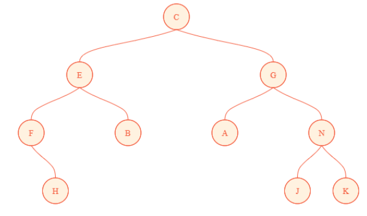
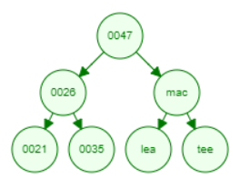

# Sample Inputs
- [**Binary Tree**](#bt)
- [**Binary Search Tree**](#bst)

### [Binary Tree](binary_tree.c) <a name="bt"></a>
Sample Input 1:
```
A B @ C @ @ @
```
<p align="center">
    
</p>

Sample Input 2:
```
C E F @ H @ @ B @ @ G A @ @ N J @ @ K @ @
```
<p align="center">
    
</p>

Sample Input 3:
```
47 26 18 13 @ @ 21 @ @ 35 30 @ @ 39 @ @ 73 61 56 @ @ 64 @ @ 75 @ @
```
<p align="center">
    
</p>

### [Binary Search Tree](binary_search_tree.c) <a name="bst"></a>
Sample Input 1:
```
mac tee ode era ria lea vim
```
<p align="center">
    
</p>

Sample Input 2:
```
47 26 18 13 21 35 30 39 73 61 56 64 75
```
<p align="center">
    
</p>

Sample Input 3:
```
47 26 mac tee 21 35 lea
```
<p align="center">
    
</p>
