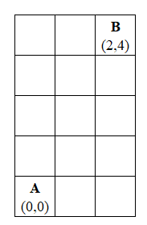
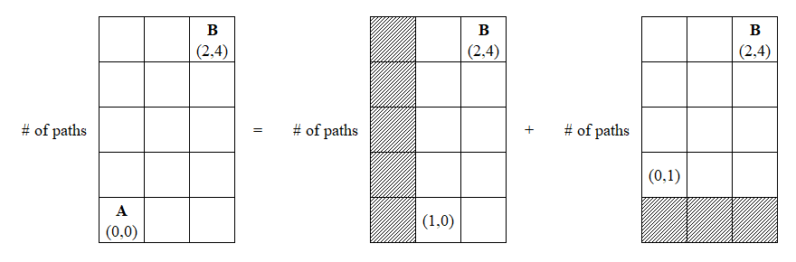

### [← Tugas Struktur Data E](../../)
# Exercises 6
> Tugas ke-4 mata kuliah Struktur Data 2024<br>
> Reference: _Noel Kalicharan - Advanced Topics in C_<br>
- [**Questions**](#qs)
    - [Q17. Separate Digits](#q17)
    - [Q18. Cartesian Path](#q18)
    - [Q19. Eight Queens Problem](#q19)
- [**Solutions**](#ss)
    - [S17. Separate Digits](#s17)
    - [S18. Cartesian Path](#s18)
    - [S19. Eight Queens Problem](#s19)

## Questions <a name="qs"></a>
### Q17. Separate Digits <a name="q17"></a>
Write a recursive function that takes an integer argument and prints the integer with one space after each digit. For example, given 7583, it prints 7 5 8 3 .

#### [Example Solution](#s17)

### Q18. Cartesian Path <a name="q18"></a>
Consider points (m, n) in the usual Cartesian coordinate system where m and n are positive integers. In a north-east path from point A to point B, one can move only up and only right (no down or left movements are allowed). Write a function that, given the coordinates of any two points A and B, returns the number of north-east paths from A to B.

#### [Solution](#s18)

### Q19. Eight Queens Problem <a name="q19"></a>
The eight-queens problem can be stated as follows: place 8 queens on a chess board so that no two queens attack each other. Two queens attack each other if they are in the same row, same column, or same diagonal. Clearly, any solution must have the queens in different rows and different columns.

One approach to solving the problem is as follows. Place the first queen in the first column of the first row. Next, place the second queen so that it does not attack the first. If this is not possible, go back and place the first queen in the next column and try again.

After the first two queens have been placed, place the third queen so that it does not attack the first two. If this is not possible, go back and place the second queen in the next column and try again.

At each step, try to place the next queen so that it does not conflict with those already placed. If you succeed, try to place the next queen. If you fail, you must backtrack to the previously placed queen and try the next possible column. If all columns have been tried, you must backtrack to the queen before this
queen and try the next column for that queen.

The idea is similar to finding a path through a maze. Write a program to solve the eight-queens problem. Use recursion to implement the backtracking.

#### [Solution](#s19)

## Solutions <a name="ss"></a>

### S17. Separate Digits <a name="s17"></a>
#### [Question](#q17)

#### Example Implementation in C++
[Full implementation](code/cpp/17.cpp)
```cpp
void separate_digit(int n, stack<int> &s)
{
    s.push(n % 10);
    n /= 10;
    if (n == 0)
    {
        while (!s.empty())
        {
            cout << s.top() << " ";
            s.pop();
        }
        return;
    }
    else
    {
        separate_digit(n, s);
    }
}
```

### S18. Cartesian Path <a name="s18"></a>
#### [Question](#q18)
Consider the point A(0, 0) and B(2, 4) on a 3 × 5 grid.
<p align="center">
    
</p>

Observe that the number of path from A to B will be sum of the number of path from (1, 0) to B and the number of path from (0, 1) to B, which respectively is 2 × 5 grid and 3 × 4 grid.
<p align="center">
    
</p>

In general, if we let $M(D_x, \text{ }D_y)$ denote the total number of path from point A($x_1, y_1$) to B($x_2, y_2$) where $Dx = x_2 - x_1$ and $Dy = y_2 - y_1$ then 

$$
M(D_x, \text{ }D_y) = M(D_x - 1, \text{ }D_y) + M(D_x, \text{ }D_y - 1) \text{ while } D_x ≥ 1 \text{ and } D_y ≥ 1.
$$

Don't forget to check whether there is a valid path from A to B (i.e B is located south-west of A).

#### Example Implementation in C++
[Full implementation](code/cpp/18.cpp)
```cpp
int paths(pair<int, int> &p1, pair<int, int> &p2)
{
    // Checking if the points are possible to traverse
    if ((p1.first < p2.first && p1.second > p2.second) || (p1.first > p2.first && p1.second < p2.second))
    {
        return 0;
    }

    int d_x = abs(p1.first - p2.first), d_y = abs(p1.second - p2.second);

    // Base case
    if ((d_x >= 1 && p1.second == p2.second) || (d_y >= 1 && p1.first == p2.first))
    {
        return 1;
    }
    else
    {
        pair<int, int> center(0, 0), n_p1(d_x - 1, d_y), n_p2(d_x, d_y - 1);
        return paths(center, n_p1) + paths(center, n_p2);
    }
}
```

### S19. Eight Queens Problem <a name="s19"></a>
#### [Question](#q19)
The Eight Queens problem can be looked up [here](https://www.geeksforgeeks.org/8-queen-problem/).
